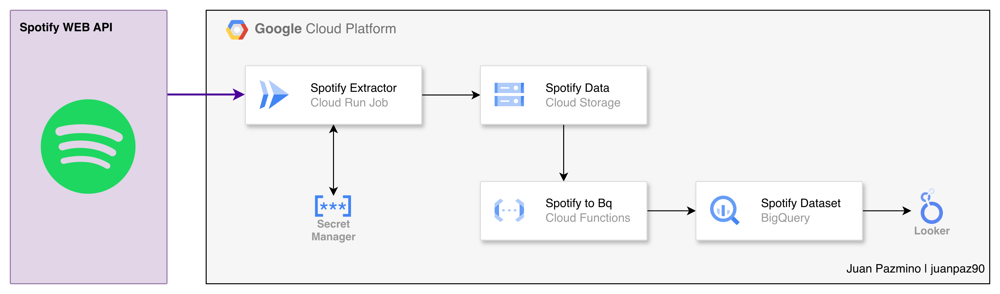

# Spotify Personal Music Analytics - ETL Pipeline

This an automated data pipeline that I used to extract my personal music listening data from Spotify API, processes, and delivers insights about music preferences and listening patterns through BigQuery and Lookerstudio.

## 📋 Table of Contents

- [Overview](#-overview)
- [Architecture](#-architecture)
- [Tech Stack](#-tech-stack)
- [Prerequisites](#-prerequisites)
- [Setup](#-setup)
- [Deployment](#-Deployment)

## 🎯 Overview

This project builds an end-to-end ETL pipeline that:

1. **Extracts** personal music data from Spotify API (saved tracks, top artists, playlists, listening history)
2. **Transforms** data by cleaning genre misspellings and enriching track information
3. **Loads** data into Google Cloud Storage and BigQuery for analysis
4. **Analyzes** music preferences using SQL views and prepares data for ML modeling

### Key Features

- Automated data extraction from Spotify API
- Incremental data processing with error resilience
- Genre-based music preference analysis
- Time-series tracking of listening patterns
- Cloud-native architecture on GCP
- CI/CD deployment with CircleCI

## 🏗️ Architecture



### Data Flow

1. **Cloud Run Job** authenticates with Spotify API using refresh tokens from Secret Manager
2. Extracts music data (saved tracks, top artists, playlists, recently played)
3. Stores raw CSV files in **Cloud Storage** bucket
4. **Cloud Function** triggers on new file uploads
5. Processes and cleans data (fixes genre misspellings)
6. Loads data into **BigQuery** tables
7. **BigQuery Views** provide analytics-ready datasets
8. **Looker Studio** connects for visualization

## 🛠️ Tech Stack

### Core Technologies
- **Python 3.12** - Primary programming language
- **Spotipy** - Spotify Web API wrapper
- **Pandas** - Data manipulation
- **Google Cloud Platform** - Cloud infrastructure

### GCP Services
- **Cloud Run Jobs** - Containerized data extraction
- **Cloud Functions** - Event-driven data loading
- **Cloud Storage** - Raw data storage
- **BigQuery** - Data warehouse and analytics
- **Secret Manager** - Secure credential storage
- **Artifact Registry** - Container image storage

### DevOps
- **Docker** - Containerization
- **CircleCI** - CI/CD automation
- **Pipenv** - Python dependency management

## ⚙️ Prerequisites

### Required Accounts
- Spotify Developer Account
- Google Cloud Platform account
- CircleCI account (for CI/CD)

### Local Development
- Python 3.12+
- Docker
- Google Cloud SDK (`gcloud` CLI)
- Pipenv

## 🚀 Setup

### 1. Spotify API Setup

1. Go to [Spotify Developer Dashboard](https://developer.spotify.com/dashboard)
2. Create a new application
3. Note your `Client ID` and `Client Secret`
4. Add redirect URI: `http://127.0.0.1:8080`

### 2. Get Refresh Token (One-time)

When the code runs for the 1st time a new file called `.cahe` is created. From it you can get the `refresh_token`.
Once you have that token your code will run wherever you want.

## 📦 Deployment
There isn't a manual deployment for this project, we are living in 2025. So embrace the beauty of automations.

### CI/CD Deployment

Push to repository triggers CircleCI pipeline:

```yaml
Workflow:
1. Approve Pipeline (manual)
2. Create Artifact Registry
3. Build & Push Container
4. Deploy Cloud Run Job
5. Deploy Cloud Function
```

### CircleCI Environment Variables

Set in CircleCI project settings:

- `PROJECT_ID` - Your GCP project ID
- `SERVICE_ACCOUNT` - Service account email
- `REPOSITORY_NAME` - Artifact Registry repository
- `IMAGE_NAME` - Container image name
- `GOOGLE_APPLICATION_CREDENTIALS` - Service account key JSON


**Built with ❤️ and 🎵 by Juan Pazmino**